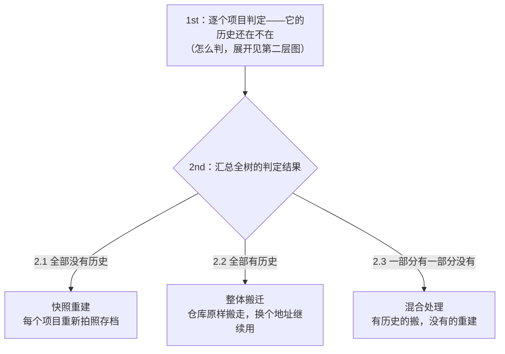
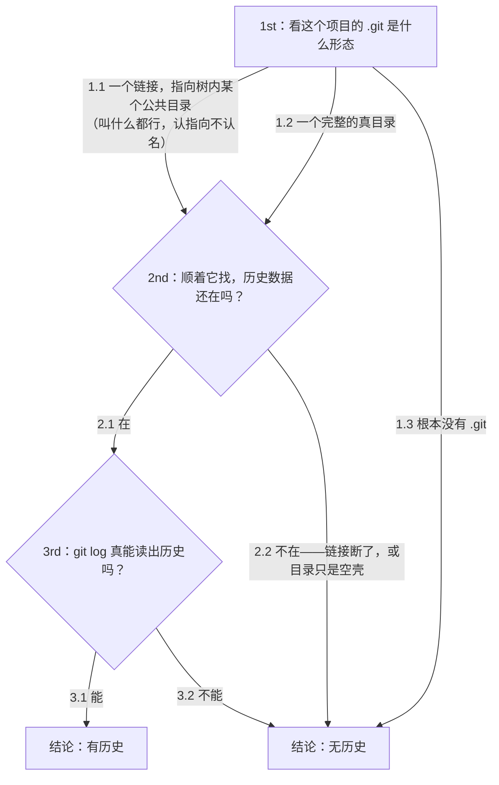

# SalvageOfSDK

**把一个「解包的厂商 SDK tarball」变成「`repo init` + `repo sync` 能拉取、能编译的内网 GitLab 工作区」。**

> **新接手？** 花 30 秒看完第一章开头的总览，然后从第 1 步开始做。
> 每步只写三件事：干什么、怎么做、怎么算完。原理和细节在附录，用到再翻。
> 第二章是形态判定的理论，第 2 步用到它。

---

## 第一章 · 操作流程

### 总览（整张地图）

```
阶段一 · 准备与判定（一次）
  第 1 步   解包 → 锁死基线 → 复制重建树
  第 2 步   判定形态：每个项目的历史还在不在（判据见第二章）
            ├─ 全部没有历史 → 阶段二（本流程的主线）
            ├─ 全部有历史   → 附录 D（整体搬迁）
            └─ 一部分有     → 两类分治：有历史的按附录 D，没有的按阶段二

阶段二 · 快照重建：对账循环（第 4~7 步反复跑，整个流程 90% 的时间在这里）
  第 3 步   生成项目清单 subprojects.txt（只做一次）
  第 4 步   重建并推送（2-rebuild.sh）
  第 5 步   发布 manifest（3-publish-manifest.sh）
  第 6 步   同步一棵候选树（repo sync）
  第 7 步   对账 → 修 .gitignore → 回到第 4 步
            循环出口：缺的文件全是「能编译出来的东西」

阶段三 · 交付（循环收敛后，只走一遍）
  第 8 步   补空目录和权限位（carry-extras.sh）
  第 9 步   最终核对（4-verify-sync.sh 全量）
  第 10 步  客户端从零验收（repo 三连 + 编译）
```

**为什么阶段二是个循环？** `git add` 会按项目里残留的 `.gitignore` 规则**静默**丢文件——不报错，磁盘上文件也还在原地，只有从 git 重新拉下来的树里才看得出缺了什么。所以必须「试跑 → 拉下来对账 → 修规则 → 再试跑」。原理和一个 30 秒的小实验见[附录 A](#附录-a-为什么-gitignore-会吞源码30-秒实验)。

### 开始之前

| 要什么 | 说明 |
|---|---|
| 磁盘 | 原始包 + 重建树 + 候选树。单棵树 20~70G，至少留 3 棵的空间（AOSP 级别 250G+） |
| 内网 GitLab | 你有建组权限。记下服务器地址和一个 group 名 |
| GitLab PAT | api 权限。**永不落盘**：每次用之前 `read -s GITLAB_TOKEN` 输进环境变量 |
| repo 工具 + SSH key | 第 6 步起需要。拉取用 SSH，key 要提前在 GitLab 配好 |

**目录约定**（后面所有命令都用这四个名字）：

| 目录 | 是什么 |
|---|---|
| `<sdk>-readonly/` | 只读基线。唯一合法参照，永不写入 |
| `<sdk>-rebuild/` | 重建树。所有修改（.gitignore）都在这里做 |
| `salvage-work/` | 工作目录。你站在这里跑脚本，清单、manifest、日志都产在这里 |
| `clone-*/` | 候选树。repo sync 拉下来的，用来对账 |

### 铁律（违反了会返工或出事）

1. **只读基线永不写入。** 它一旦被污染，你就再也无法证明重建结果是对的。
2. **token 永不落盘。** 不进脚本、不进 commit、不进日志、不进 `.git/config`、不进笔记。先 `read -s GITLAB_TOKEN` 再跑命令。
3. **每次重跑必须安全。** 中断和重跑是常态，脚本按这个假设设计；你手工操作时也要守住。

---

### 第 1 步 · 解包、锁死、复制

**干什么**：得到两棵树——一棵锁死的基线（永不再动，是对账的唯一标准），一棵可写的重建树（所有修改都在它身上做）。

```bash
tar -xf <厂商包> -C <path>/<sdk>-readonly
chmod -R a-w <path>/<sdk>-readonly          # 锁死基线

cp -a <path>/<sdk>-readonly <path>/<sdk>-rebuild
chmod -R u+w <path>/<sdk>-rebuild           # 重建树恢复可写

mkdir <path>/salvage-work                   # 工作目录
```

**怎么算完**：

```bash
find <path>/<sdk>-readonly -name .git | wc -l    # 记下这个数（rk3588-android12 = 1084）
find <path>/<sdk>-readonly -writable | wc -l     # 必须是 0
```

> 这个 `.git` 数量是发现项目边界的依据，也是污染探测器：每次大动作前后复核，
> 变了说明基线被碰过，重新解包。rk3576 的 tarball 是 0（全树没有 `.git`），
> rk3588-android12 是 1084，两种都正常。

### 第 2 步 · 判定形态

**干什么**：按第二章的判据，给每个项目打「有历史 / 无历史」的标签，汇总出全树的命运，决定后面走哪条路。

**怎么做**（判定脚本 `1-triage.sh` 规划中，当前用第二章 2.3 的手工命令，判据相同）：

```bash
# 粗筛：全树有没有活着的历史数据（-L 跟随符号链接，不加活链接会漏判）
find -L <path>/<sdk>-readonly -path '*/.git/objects' -type d
```

1. 结果 = 0 → 全树无历史，走阶段二，第 3 步见。
2. 结果 > 0 → 有候选项目，逐项目细判：`git -C <项目> log -1`，能打出提交的才算真有历史（排除空壳，见第二章）。全部有历史 → 附录 D；一部分有 → 附录 D 和阶段二各管一类。

**怎么算完**：你能说出这棵树是三种命运里的哪一种，并且有依据。

---

### 第 3 步 · 生成项目清单（只做一次）

**干什么**：告诉 `2-rebuild.sh` 哪些目录是独立项目（每个项目 = 一个 GitLab 仓库）。

**为什么手工生成**：脚本的自动扫描只认「`.git` 是符号链接」的形态（rk3576 是那种）。rk3588 的 `.git` 是骨架目录，自动扫描会漏掉几乎全部。脚本约定：`subprojects.txt` 已存在就跳过扫描直接复用——所以手工生成即可，不用改脚本。

```bash
cd <path>/salvage-work
find <path>/<sdk>-rebuild -name .git \( -type l -o -type d \) \
    -exec bash -c 'realpath "$(dirname "{}")"' \; | sort > subprojects.txt
wc -l subprojects.txt     # 必须等于第 1 步记下的数（1084）
head -3 subprojects.txt   # 抽查：路径必须指向 rebuild 树，不能是 readonly
```

**⚠️ 卡住了**

| 症状 | 处置 |
|---|---|
| 清单行数和第 1 步记的数对不上 | find 的起点指错了树，或树被碰过。先复核 readonly 的 `.git` 计数 |
| 清单里出现 readonly 的路径 | 删掉重生成。第 4 步会对这些路径 `rm -rf .git`，指错树会撞在只读锁上 |

### 第 4 步 · 重建并推送

**干什么**：对清单里每个项目 `git init + add + commit`，在 GitLab 建仓库并 push，最后生成 `default.xml`。

```bash
cd <path>/salvage-work
read -s GITLAB_TOKEN     # PAT 输进环境变量，不进命令历史
<SalvageOfSDK>/2-rebuild.sh <path>/<sdk>-rebuild \
    --gitlab-url="http://<server>" \
    --gitlab-group="<GROUP>" \
    --git-user-name="<name>" \
    --git-user-email="<email>" \
    --gitlab-token="$GITLAB_TOKEN" --push \
    2>&1 | tee -a build-$(date +%m%d-%H%M).log
```

**怎么算完**：日志尾部「全部完成：共 N 个子工程……已 Push N 个」，N = 清单行数；GitLab 网页上能看到这些仓库。

**重跑行为**（在循环里会反复用到，必读）：

1. 已经是 git 仓库的项目 → **SKIP，不会重新 add**。改了某项目的 `.gitignore` 想让它生效：改的项目少走第 7 步的小环；改的项目多就 `rm -rf <rebuild>/<项目>/.git`（每个改过的项目）再重跑本步。
2. push 带 `-f`：覆盖的是自己上一轮推的内容，安全。
3. 中断后原命令重跑即可：已完成的项目自动跳过，`default.xml` 从头重建，不会重复。

**⚠️ 卡住了**

| 症状 | 处置 |
|---|---|
| 日志里出现明文 token | git-lfs 会回显带凭据的 push URL。**日志不要提交**，第 5 步的白名单也防这个 |
| 某个项目 push 失败 | 网络抖动居多。原命令重跑，从断点继续 |
| LFS 相关报错 | 确认 git-lfs 已装且过滤器已初始化（脚本启动时会查） |

### 第 5 步 · 发布 manifest

**干什么**：把第 4 步产出的 `default.xml` 发布成一个 git 仓库（默认名 manifests），客户端 `repo init` 拉的就是它。

```bash
cd <path>/salvage-work     # 必须和第 4 步同一个目录，它读这里的 default.xml
<SalvageOfSDK>/3-publish-manifest.sh \
    --gitlab-url="http://<server>" \
    --gitlab-group="<GROUP>" \
    --gitlab-token="$GITLAB_TOKEN" \
    --git-user-name="<name>" \
    --git-user-email="<email>" \
    --dry-run
```

先 `--dry-run` 空跑（检查全做，不建库不推），全绿后**去掉 `--dry-run` 原样重跑**。这个脚本没有 `--push` 选项，不要加。

它只提交 `default.xml` + `.gitignore`（严格白名单）——同目录的构建日志里有明文 token，绝不能进库。

### 第 6 步 · 同步一棵候选树

**干什么**：扮演客户端，把推上去的仓库拉成一棵完整的树，供第 7 步对账。

**为什么需要它**：重建树磁盘上的文件是「全」的——被 `.gitignore` 丢掉的文件也还躺在原地，在重建树上对账什么都看不出来。只有从 git 重新拉下来的树才会显形。

```bash
mkdir <path>/clone-$(date +%m%d) && cd <path>/clone-$(date +%m%d)
repo init -u ssh://git@<server>/<GROUP>/manifests.git -b main --no-clone-bundle
repo sync -j8
repo forall -c 'git lfs pull' -j4     # 不跑这步，大文件只是指针，对账会误报
```

**怎么算完**：`repo list | wc -l` = 清单行数；`du -sh .` 和 rebuild 树同一量级。

### 第 7 步 · 对账，修 .gitignore（循环核心）

**干什么**：候选树 vs 只读基线，逐项比，缺什么修什么。修完回第 4 步，直到收敛。

```bash
cd <path>/salvage-work
<SalvageOfSDK>/4-verify-sync.sh \
    --baseline-dir <path>/<sdk>-readonly \
    --candidate-dir <path>/clone-<date> \
    --work-dir ./verify-$(date +%m%d) \
    --skip-content > verify-report.txt
```

`--work-dir` 留下证据文件（缺文件清单就在里面）；`--skip-content` 只比「文件在不在」，秒级完成（逐字节比对留给第 9 步）。

**看哪个文件**：`verify-*/entries-missing.diff`——基线有、候选没有的全部条目。每行格式 `类型<TAB>路径`，第 1 列 f=文件、d=目录。

```bash
# 按项目统计，从缺得最多的开始修
awk -F'\t' '$1=="f"{split($2,a,"/"); print a[1]"/"a[2]}' \
    verify-*/entries-missing.diff | sort | uniq -c | sort -rn
```

**每个项目怎么修**（判断标准和照抄案例在[附录 B](#附录-b-修-gitignore-的手法)）：

1. 在**基线**里看这堆文件是什么：`find <readonly>/<项目>/<被吞目录> | sort`
2. 在**重建树**里定位是哪条规则吞的：`git -C <rebuild>/<项目> check-ignore -v <文件>`
3. 这批文件**大部分是构建产物** → 保留规则，白名单放行少数；**全部是源码** → 规则整条删掉
4. 改的是 `<rebuild>/<项目>/.gitignore`，永远不碰基线

**改完怎么生效（小环，改的项目少时用）**：

```bash
cd <rebuild>/<项目>
git add -A . && git commit --amend --no-edit && git push -f
cd <path>/clone-<date> && repo sync --force-sync <项目路径>
# 然后重跑本步开头的对账
```

改的项目多，或想全量确认（大环）：`rm -rf <rebuild>/<项目>/.git`（每个改过的项目），回到第 4 步。

**循环出口**：`entries-missing.diff` 里剩下的每一项，你都能说出「这是能编译出来的东西」。不是零，是只剩产物。

**⚠️ 卡住了**

| 症状 | 处置 |
|---|---|
| 想用 `git add -f` 绕过 | 不要。治不了根，下次重建又是一样。改 `.gitignore` 本身 |
| 子目录的 `.gitignore` 写了 `!` 规则却不生效 | 死否定：父级规则已剪掉整个目录，git 不会递归进去读它。删父级规则（附录 B） |
| 对账报告里全树都缺 | 八成是候选树没拉全：`repo sync` 的报错没注意，或 `lfs pull` 没跑。回第 6 步 |
| `check-ignore` 报 `--non-matching is only valid with --verbose` | `-n` 必须配 `-v` |

---

### 第 8 步 · 补空目录和权限位

**干什么**：git 存不了空目录，权限也只存一个执行位。把空目录和完整权限位录成清单，由 repo hook 在每次 sync 后自动回放。

```bash
<SalvageOfSDK>/5-fixtools/carry-extras.sh \
    --repo-hook-dir=<path>/repo-hooks \
    --baseline-dir=<path>/<sdk>-readonly \
    --gitlab-url="http://<server>" \
    --gitlab-group="<GROUP>" \
    --git-user-name="<name>" \
    --git-user-email="<email>" \
    --gitlab-token="$GITLAB_TOKEN" --push
```

跑完会打印**两行 XML，粘贴进 `salvage-work/default.xml`**，然后重跑一次第 5 步（把 hook 项目加进 manifest，重新发布）。

> hook 的检出路径不能叫 `.repo-hooks`（repo 会拒绝），脚本已处理。

### 第 9 步 · 最终核对

候选树重新同步（这次带 `--verify`，hook 才会执行、空目录才会出现），然后全量对账：

```bash
cd <path>/clone-<date>
repo sync -j8 --verify         # 询问是否允许 hook 时答 yes

cd <path>/salvage-work
<SalvageOfSDK>/4-verify-sync.sh \
    --baseline-dir <path>/<sdk>-readonly \
    --candidate-dir <path>/clone-<date> \
    --work-dir ./verify-final > verify-final.txt
```

不加 `--skip-content`，六个 section 全看。以下差异是**预期内**的，不用修：

1. 候选独有的 `.gitattributes`——为 LFS 加的，我们故意引入
2. `.gitignore` 内容差异——我们改的
3. umask 类权限差异——git 只存一个执行位，其余位由 umask 决定

### 第 10 步 · 客户端验收

换一个干净目录（最好是另一台机器），完全按同事将来的用法从零走：

```bash
repo init -u ssh://git@<server>/<GROUP>/manifests.git -b main --no-clone-bundle
repo sync -j8 --verify
repo forall -c 'git lfs pull' -j4
```

**三条命令缺一不可。** 然后逐项验收：项目数对、`du -sh` 量级对（明显偏小说明 lfs pull 没跑）、顶层符号链接在、hook 补的空目录在、`./build.sh` 能编出固件。

---

### 附录 A · 为什么 .gitignore 会吞源码（30 秒实验）

```bash
$ mkdir demo && cd demo && mkdir build
$ echo '/build' > .gitignore          # 厂商留下的规则
$ echo 'int main(){}' > main.c
$ echo '#!/bin/sh' > build/gen.sh     # 它其实是源码
$ git init -q && git add . && git status --short
A  .gitignore
A  main.c
```

`build/gen.sh` 消失了。**不报错、不警告，静默消失。**

厂商为什么没丢：在厂商的上游仓库里，这个文件早就被跟踪了（规则出现之前就在，或当年 `git add -f` 强加的），`.gitignore` 管不了已跟踪的文件。tarball 是从那棵树拷出来的，所以文件在包里。你从 tarball 全新 `git init`：**没有任何文件被跟踪**，规则第一次真正生效，把源码当垃圾扔了。

这不是厂商写错了——规则在上游的语境里是对的。是「从快照重建」这个动作，必须重新裁决每条规则。

### 附录 B · 修 .gitignore 的手法

**判断标准（唯一标准）**：只要能够被编译出来的，都是临时文件，只保留源文件。不追求一字不差，追求能编译通过。

**已解决的案例（rk3576，照抄即可）**：

| 项目 | 规则 | 结论 |
|---|---|---|
| `kernel-6.1` | 多条 | 90 项里 66 项确为产物，放行其余 |
| `external/rkwifibt` | `.gitignore:80` 的 `/debian/` | **整行删掉，不加替代**。厂商自己的 `debian/.gitignore` 13 行本来就完整，删掉父级规则它就生效了 |
| `external/mpp` | `.gitignore:87` 的 `/build` | `build/` 下 41 项全是源码，0 产物。用白名单放行 |

`external/mpp` 的白名单写法：

```gitignore
/build/**
!/build/**/
!/build/**/.gitignore
!/build/**/*.bash
!/build/**/*.bat
!/build/**/*.cmake
!/build/**/*.in
!/build/**/*.md
!/build/**/*.sh
```

> **`!/build/**/` 必须在第一位。** 它放行的是**目录**（结尾斜杠）。
> 少了它，`/build/**` 会挡住子目录本身，git 不递归进去，后面所有放行行全部失效。
> 这是这段规则里唯一的坑。

**技巧与坑**：

| 情况 | 处置 |
|---|---|
| 子目录有 `.gitignore` 写了 `!*.sh` 却不生效 | 死否定：父级规则已剪掉整个目录，git 不会递归进去读它。删父级规则 |
| 项目里有大量无扩展名的可执行产物 | 黑名单挡不住（例：mpp 约 48 个 `*_test`）。用白名单 |
| 用 `entries-missing.diff` 过滤 | 格式是 `类型<TAB>路径`，路径不带尾斜杠。按文件过滤必须 `awk -F'\t' '$1=="f"'`，不能 `grep -v '/'` |

### 附录 C · 工具清单

| 脚本 | 干什么 | 碰不碰网络 |
|---|---|---|
| `1-triage.sh` | **规划中**。第二章判定流程的自动化：逐项目打标签、汇总全树命运、产出清单 | 否 |
| `2-rebuild.sh` | 逐子项目 `git init + add + commit`，建 GitLab 仓库，推送，生成 `default.xml` | 是 |
| `3-publish-manifest.sh` | 把 `default.xml` 发布为 manifest 仓库 | 是 |
| `4-verify-sync.sh` | 两棵树做 6 项断言的对账，纯只读 | 否 |
| `5-fixtools/adopt-dir.sh` | 补收 repo 从未管理过的目录 | 是 |
| `5-fixtools/carry-extras.sh` | 记录+回放空目录和权限位 | 是 |
| `5-fixtools/post-sync.py` | repo hook，sync 后重建空目录 | — |

`libs/` 是共享库，外部脚本尽量薄。每个脚本都有 `-h`，参数细节以 `-h` 为准。

> `archived/` 是废弃方案（python / bash / rust 三代尝试），仅作历史保留。
> 尤其 `archived/python/README.md` 曾经占据仓库根 README 的位置误导读者——不要照它操作。

### 附录 D · 整体搬迁与混合处理（第 2 步判定「有历史」时走这里）

**整体搬迁**（全树都有历史），三步：

1. 公共目录（`.repo/projects/` 或同等目录，认链接指向不认名字）里的每个仓库**原样 push** 到你的 GitLab——带全部历史，一个 commit 不丢。
2. 拿原始 `default.xml`，**只改拉取地址**为你的服务器；每个项目钉的版本原样保留。
3. 把它发布为你自己的 `manifests.git`。

不修 `.gitignore`（tracked 状态还在，规则吞不了已跟踪的文件），不快照。

**清单丢了也能搬**：每个项目工作树的 HEAD 就是当时钉的版本，逐个读出 sha 写进新 manifest。

**混合处理**（一部分项目有历史）：

1. 有历史的项目：按上面搬迁走，**并从 `subprojects.txt` 里剔除**（别让 `2-rebuild.sh` 碰它们）。
2. 没历史的项目：走第 3~7 步的快照重建循环。
3. 两类项目进同一个 manifest，一起发布。

> 这条路径目前没有专用脚本（手上还没有真实样例树）。遇到时按本节的步骤手工执行，
> 跑通后把验证过的步骤沉淀成脚本。

---

### 收尾清单

- [ ] revoke 本次用的 PAT
- [ ] 检查所有 `.git/config` 无明文凭据：
      `find <tree> -name config -path '*/.git/*' | xargs grep -l '://[^:/@]*:[^@]*@'`
- [ ] 笔记/文档里的 token 换成变量
- [ ] 构建日志不要提交
- [ ] `SalvageOfSDK.git` 推送

---

## 第二章 · 判断 tarball 的形态

判定的对象是**每一个项目**，判据只有一条：它的历史数据还在不在。
全树的命运，就是所有项目判定结果的汇总。

### 2.1 历史住在哪里

repo 工作区里，项目的 `.git` 通常不是仓库本身，而是指向树内某个公共目录的**相对路径符号链接**。这个公共目录一般叫 `.repo`，但叫什么都可以——判定认"链接指向哪"，不认名字：

```
SDK根/
├── kernel-5.10/.git  →  ../../.repo/projects/kernel-5.10.git/   ← 指针（相对路径，不指出树外）
└── .repo/
    ├── projects/kernel-5.10.git/      ← 真正的仓库本体
    ├── project-objects/               ← 多项目共享的历史数据（大头在这里）
    └── manifests/ + manifests.git/    ← 原始清单：每个项目钉在什么版本
```

历史 = 仓库本体里存放的数据（git 术语叫"对象库"，每个文件的每个版本都在里面）。
数据在，历史就在；链接死没死只是表象。

### 2.2 判定流程

**顶层图：一棵树的三种命运**



**第二层图：单个项目怎么判定（顶层图 1st 的展开）**



> 陷阱只在一种地方：有的项目 `refs`、`HEAD` 完好，`git rev-parse HEAD` 正常返回一串版本号，**看起来像**有历史，但历史数据本身是空的，`git log` 立刻报错。所以判定必须跑到 3rd，不能停在"看起来像"。

三种命运分别干什么：

1. **快照重建**：每个项目 `git init` 重新建档 → 修 `.gitignore`（没有 tracked 状态替规则挡枪，规则会把源码当垃圾静默吞掉）→ 推送 → 生成 manifest。
2. **整体搬迁**，三步：
   1. 公共目录里的每个仓库**原样 push** 到你的 GitLab（带全部历史，一个 commit 不丢）；
   2. 原始 `default.xml` **只改拉取地址**为你的服务器，每个项目钉的版本不动；
   3. 发布为你自己的 `manifests.git`。

   不修 `.gitignore`（tracked 状态还在），不快照。
3. **混合处理**：有历史的项目按"整体搬迁"走，没历史的按"快照重建"走，两类项目进同一个 manifest。

### 2.3 检测命令

先粗筛（一条命令，只读基线上跑）：

```bash
# -L 跟随符号链接；不加，活链接会被漏判
find -L <readonly树> -path '*/.git/objects' -type d
```

1. 结果 = 0 → 全树无历史，按"快照重建"走。
2. 结果 > 0 → 有候选项目，**细判**：逐项目 `git -C <项目> log -1`，能打出提交的才算真有历史（排除空壳）。

由判定流程直接推出的几个事实：

1. 公共目录整个不在 → 指向它的链接全是死链 → 粗筛必然为 0 → 快照重建。
2. 公共目录在、历史数据被删 → 空壳，细判露馅。
3. 公共目录在、历史数据在、清单丢了 → 历史照救；清单可重建：每个项目工作树的 HEAD 就是当时钉的版本，读出来写进新 manifest。
4. `.repo/repo/`（repo 工具本身）在不在无所谓——工具随处可装，不是数据。

两种真实样例在图上的走法：

1. **rk3576**：`.git` 全是断链符号链接 → 1.1 → 2.2 → 无历史 → 全树快照重建。
2. **rk3588-android12**：`.git` 是骨架目录，里面的数据入口全是断链 → 1.2 → 2.2 → 无历史 → 全树快照重建。
