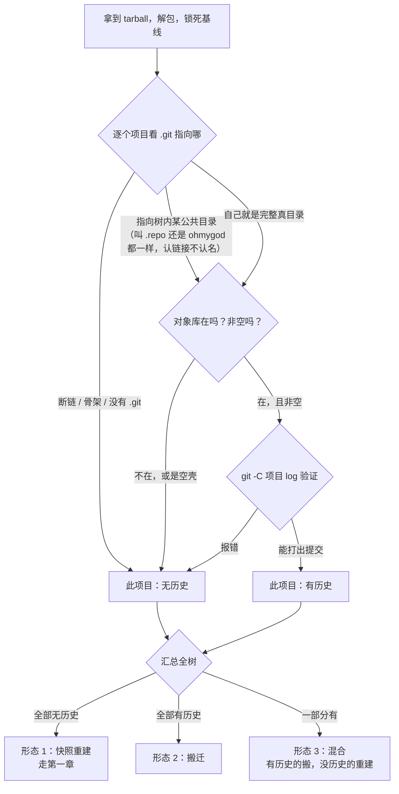

# SalvageOfSDK

**把一个「解包的厂商 SDK tarball」变成「`repo init` + `repo sync` 可拉取的 GitLab 工作区」。**

> **新接手？直接按下面 7 步走，这就是唯一入口。**
> 每步末尾的「⚠️ 卡住了」就是该步的排错表，排错不单独成文。

---

## 第一章 · 操作流程（快照重建 SOP）

> 本章的前提是：**这个 tarball 的历史已经没了**，只能按快照重建。
> 拿到任何 tarball，先按[第二章](#第二章--理论tarball-的形态判断)判断形态，确认是形态 1 再走本章。

### 适用前提

- 厂商给的是 tarball（解包后**全树没有可用 `.git`**：要么没有，要么只剩骨架/断链），不是 git 仓库
- 有一台内网 GitLab，你有建组权限
- 磁盘：原始包 + 重建树 + 验证树，准备 **100G 以上**（AOSP 级别准备 250G+）

### 铁律（违反了会返工或出事）

1. **原始解包树设为只读，永不写入。** 它是唯一合法基线。
   一旦被污染，你就再也无法证明重建结果是对的。
2. **token 永不落盘。** 不进脚本、不进 commit、不进日志、不进 `.git/config`、不进笔记。
   只作为命令行参数传入。
3. **`--push` 之前做完一切。** 脚本默认不推，加 `--push` 才推。
4. **每次重跑必须安全。** 不允许覆盖数据这类灾难后果。

### 工具总览

| 脚本 | 干什么 | 写不写网络 |
|---|---|---|
| （手工） | 解包 tarball，设只读 | — |
| `2-rebuild.sh` | 逐子项目 `git init` + `add` + `commit`，建 GitLab 仓库，推送，生成 `default.xml` | 是 |
| `3-publish-manifest.sh` | 把 `default.xml` 发布为 manifest 仓库 | 是 |
| `4-verify-sync.sh` | 拿 `repo sync` 出来的树和只读基线做 6 项断言 | 否（只读） |
| `5-fixtools/adopt-dir.sh` | 补收 repo 从未管理过的目录 | 是 |
| `5-fixtools/carry-extras.sh` | 记录+回放空目录和权限位 | 是 |
| `5-fixtools/post-sync.py` | repo hook，sync 后重建空目录 | — |

`libs/` 是共享库，外部脚本尽量薄。`libs/gitlab.sh` 管凭据，**故意不进 hook 分发包**。

每个脚本都有 `-h`，参数细节以 `-h` 为准。

> `archived/` 是废弃方案（python / bash / rust 三代尝试），仅作历史保留。
> 尤其 `archived/python/README.md` 曾经占据仓库根 README 的位置误导读者 —— 不要照它操作。

---

### 第 1 步 · 解包并锁死基线

```bash
# 解包到只读目录（命名带 -readonly 后缀，提醒自己）
tar -xf <厂商包> -C <path>/<sdk>-readonly

# 锁死
chmod -R a-w <path>/<sdk>-readonly
```

再复制一份作为**重建源**（所有 `.gitignore` 修改都在这里做）：

```bash
cp -a <path>/<sdk>-readonly <path>/<sdk>-rebuild
chmod -R u+w <path>/<sdk>-rebuild
```

**检查点：** 记录基线里 `.git` 骨架的数量，之后每次大动作前后都复核它不变：

```bash
find <path>/<sdk>-readonly -name .git | wc -l
```

> rk3576 的 tarball 一个 `.git` 都没有（数量 = 0）；rk3588-android12 有 1084 个骨架。
> 两种都正常 —— 关键是**这个数就是你发现项目边界的依据，且不允许中途变化**。

### ⚠️ 卡住了

| 症状 | 处置 |
|---|---|
| 基线里 `.git` 数量和上次记录不一致 | 已被污染。重新解包，别省这一步 |
| 磁盘不够 | 单棵树 20-70G，至少留 3 棵的空间 |

---

### 第 2 步 · 修 `.gitignore`（**最费时的一步**）

### 为什么必须修

`.gitignore` **只对未跟踪文件生效**。厂商上游仓库里被规则命中的文件早已是
tracked 状态，规则对它们无效。你从 tarball `git init` + 全新 `git add`，
**没有任何文件是 tracked**，豁免消失 —— 规则会吞掉本该保留的源码。

**这不是厂商写错了。** 在厂商的语境里那些规则是正确的。

### 判断规则（唯一标准）

> **只要能够被编译出来的，都是临时文件，只保留源文件。**

不追求 bitwise 一致，**追求能编译通过**。两者难度差距大的时候，选后者。

### 怎么做

**不要一次性扫全树列个大清单。** 一个大目录一个大目录地过。

```bash
# 1) 先做一轮 2-rebuild + 4-verify，拿到缺失清单
#    产物：<work-dir>/entries-missing.diff

# 2) 按项目统计，从数量最多的开始
awk -F'\t' '{split($2,a,"/"); print a[1]"/"a[2]}' entries-missing.diff | sort | uniq -c | sort -rn
```

对每个项目：

```bash
# 3) 看这批文件到底是什么（在只读基线里看，不是重建树）
cd <readonly>/<project>
find <被吞的目录> | sort

# 4) 定位是哪条规则吞的
git -C <rebuild>/<project> check-ignore -v <文件路径>
```

然后判断：**这些文件里有几个是构建产物？**

- 大部分是产物 → 保留规则，只放行少数（例：`kernel-6.1` 90 项里 66 项是产物）
- **全部是源码** → 规则整条删掉（例：`external/mpp/build/` 41 项全是源码）

### 已解决的案例（照抄即可）

| 项目 | 规则 | 结论 |
|---|---|---|
| `kernel-6.1` | 多条 | 90 项里 66 项确为产物，放行其余 |
| `external/rkwifibt` | `.gitignore:80` 的 `/debian/` | **整行删掉，不加替代**。厂商自己的 `debian/.gitignore` 13 行本来就完整，删掉父级规则它就生效了 |
| `external/mpp` | `.gitignore:87` 的 `/build` | `build/` 下 41 项**全是源码，0 产物**。用白名单放行 |

`external/mpp` 的白名单写法：

```gitignore
/build/**
!/build/**/
!/build/**/.gitignore
!/build/**/*.bash
!/build/**/*.bat
!/build/**/*.cmake
!/build/**/*.in
!/build/**/*.md
!/build/**/*.sh
```

> **`!/build/**/` 必须在第一位。** 它放行的是**目录**（结尾斜杠）。
> 少了它，`/build/**` 会挡住子目录本身，git 不递归进去，后面所有放行行全部失效。
> 这是这段规则里唯一的坑。

### ⚠️ 卡住了

| 症状 | 处置 |
|---|---|
| 想用 `git add -f` 绕过 | **不要。** 治不了根，下次重建又是一样。改 `.gitignore` 本身 |
| 子目录有 `.gitignore` 写了 `!*.sh` 却不生效 | **死否定**：父级规则已剪掉整个目录，git 不会递归进去读它。删父级规则 |
| `git check-ignore` 报 `--non-matching is only valid with --verbose` | `-n` 必须配 `-v` |
| `git check-ignore --no-index --stdin` 喂**不存在**的路径，目录斜杠规则永不匹配 | 它无法知道路径是目录。这种验证方式无效，别用 |
| 用 `entries-missing.diff` 过滤时把目录和文件搞混 | 格式是 `%y\t%P`，**`%P` 不给目录加尾斜杠**。`d`/`f` 只在第 1 列。必须 `awk -F'\t' '$1=="f"'`，不能 `grep -v '/'` |
| 项目里有大量无扩展名的可执行产物 | 黑名单挡不住（例：mpp 约 48 个 `*_test`）。用白名单 |

---

### 第 3 步 · 重建并推送

```bash
<SalvageOfSDK>/2-rebuild.sh <rebuild-dir> \
	--gitlab-url="http://<server>" \
	--gitlab-group="<GROUP>" \
	--git-user-name="<name>" \
	--git-user-email="<email>" \
	--gitlab-token="$GITLAB_TOKEN" \
	2>&1 | tee -a ./build-$(date +%b%d.%Y-%H%M%S).log
```

> `2-rebuild.sh` **不要改**。
> token 用环境变量，别写进命令历史：先 `read -s GITLAB_TOKEN` 再跑。

**检查点：** 日志尾部无 error；GitLab 上项目数对得上。

### ⚠️ 卡住了

| 症状 | 处置 |
|---|---|
| 构建日志里出现明文 token | git-lfs 会回显带凭据的 push URL。**日志不要提交**，这也是 `3-publish-manifest.sh` 只按白名单提交的原因 |
| 某个项目 push 失败 | 单独重推。remote 会被恢复成 SSH |
| LFS 相关报错 | 检查 `.gitattributes` 是否生成（强制 add） |

---

### 第 4 步 · 发布 manifest

先 dry-run：

```bash
<SalvageOfSDK>/3-publish-manifest.sh \
	--gitlab-url="http://<server>" \
	--gitlab-group="<GROUP>" \
	--gitlab-token="$GITLAB_TOKEN" \
	--git-user-name="<name>" \
	--git-user-email="<email>" \
	--dry-run
```

确认无误后去掉 `--dry-run`，加 `--push`。

**设计要点：** manifest 里 fetch 用 **SSH**（不存凭据），push 才用 HTTP+PAT。
提交走**严格白名单**：只有 `default.xml` + `.gitignore`，防止日志里的 token 被带进去。

---

### 第 5 步 · 补空目录和权限位

git 不存空目录，厂商包里有一批空目录是编译必需的。

```bash
<SalvageOfSDK>/5-fixtools/carry-extras.sh \
	--repo-hook-dir="<path>/repo-hooks.git" \
	--baseline-dir="<path>/<sdk>-readonly" \
	--gitlab-url="http://<server>" \
	--gitlab-group="<GROUP>" \
	--git-user-name="<name>" \
	--git-user-email="<email>" \
	--gitlab-token="$GITLAB_TOKEN" \
	--push
```

它把空目录和权限位记录下来，由 `post-sync.py` 作为 repo hook 在 sync 后回放。

> hook 走**独立的 `repo-hooks.git`**，不放进 `manifests.git`。
> hook 检出路径不能叫 `.repo-hooks` —— repo 会拒绝。

**⚠️ 这一步的成果依赖客户端带 `--verify`。** 不带就停在 `(yes/always/NO)` 提问上，
默认 NO，hook 不执行，空目录不出现，编译可能失败。

---

### 第 6 步 · 核对（6 项断言）

拿一棵**真正 `repo sync` 出来的树**和只读基线比：

```bash
time <SalvageOfSDK>/4-verify-sync.sh \
	--baseline-dir <path>/<sdk>-readonly \
	--candidate-dir <path>/clone-<date> \
	--work-dir ./verify-<date>
```

> 改 `4-verify-sync.sh` 需要评审。

6 个 section 和典型失败：

| # | 查什么 | 典型失败 |
|---|---|---|
| 1 | 项目集合 | — |
| 2 | 文件清单 | 被 `.gitignore` 吞掉的源码 → 回第 2 步 |
| 3 | — | — |
| 4 | 符号链接 | 指向构建产物的链接被规则吞掉 |
| 5 | 权限位 | umask 差异 |
| 6 | 文件内容 | `.gitignore` 自身被我们改过（预期） |

**候选独有**的 `.gitattributes` 是我们为 LFS 加的，**属于预期**，不是错误。

### ⚠️ 卡住了

| 症状 | 处置 |
|---|---|
| section 5 一堆权限差异 | umask 造成。按「能编译即可」的底线，可接受 |
| section 2 有 PLAIN（非 ignored）的缺失项 | 该项目的 `.gitignore` **自身也在缺失清单里**。用基线里的那份规则文件来归因 |
| 核对的是错误的树 | 确认 `--candidate-dir` 是 `repo sync` 出来的，不是重建源 |
| 有些目录 repo 从未管理过 | 用 `5-fixtools/adopt-dir.sh`，`cd` 到目标目录再跑 |

---

### 第 7 步 · 客户端验收

在干净目录从零走一遍：

```bash
repo init -u ssh://git@<server>:<GROUP>/manifests.git -b main --no-clone-bundle
repo sync -j8 --verify                    # --verify 才会执行 post-sync hook（第 5 步的空目录）
repo forall -c 'git lfs pull' -j4         # ★ 必须这步，否则大文件只是 LFS 指针
```

**三条命令缺一不可。** 然后检查：

```bash
repo list | wc -l    # 项目数对得上
du -sh .             # 明显偏小（如只有 17G/28G）说明 lfs pull 没跑
ls -l <顶层应有的符号链接>
./build.sh all       # 终极验收：能编译出固件
```

---

### 收尾清单

- [ ] revoke 本次用的 PAT
- [ ] 检查所有 `.git/config` 无明文凭据：
      `find <tree> -name config -path '*/.git/*' | xargs grep -l '://[^:/@]*:[^@]*@'`
- [ ] 笔记/文档里的 token 换成变量
- [ ] 构建日志不要提交
- [ ] `SalvageOfSDK.git` 推送

---

## 第二章 · 判断 tarball 的形态

判定的对象是**每一个项目**，判据只有一条：它的 `.git` 后面有没有活着的对象库。
全树的形态，就是所有项目判定结果的汇总。

### 2.1 历史住在哪里

repo 工作区里，项目的 `.git` 通常不是仓库本身，而是指向树内某个公共目录的**相对路径符号链接**。这个公共目录一般叫 `.repo`，但叫什么都可以——判定认"链接指向哪"，不认名字：

```
SDK根/
├── kernel-5.10/.git  →  ../../.repo/projects/kernel-5.10.git/   ← 指针（相对路径，不指出树外）
└── .repo/
    ├── projects/kernel-5.10.git/      ← 真正的仓库：objects、refs、HEAD
    ├── project-objects/               ← 多项目共享的对象库（历史的大头在这里）
    └── manifests/ + manifests.git/    ← 原始清单：每个项目钉在什么版本
```

历史 = 对象库里的字节。对象库在，历史就在；链接死没死只是表象。

### 2.2 判定流程



对每个项目，`.git` 只有三种处境：

1. **活链接 / 完整真目录**：后面有非空对象库，`git log` 能打出历史 → 这个项目**有历史**。
2. **断链 / 骨架**：指向的目录不存在（rk3576），或目录里的 objects/refs 全是断链（rk3588）→ **无历史**。
3. **空壳**：refs、HEAD 完好，`git rev-parse HEAD` 正常返回 sha，但对象库是空的，`git log` 立刻报错 → **无历史**。这是唯一的陷阱：rev-parse 会骗你，判定必须落到 `git log`。

三种全树形态分别干什么：

1. **形态 1 · 快照重建**：走第一章。`.gitignore` 必须修，因为没有 tracked 状态替规则挡枪。
2. **形态 2 · 搬迁**，三步：
   1. 公共目录里的每个仓库**原样 push** 到你的 GitLab（带全部历史，一个 commit 不丢）；
   2. 原始 `default.xml` **只改 fetch 地址**为你的服务器，revision 钉的 sha 不动；
   3. 发布为你自己的 `manifests.git`。

   不修 `.gitignore`（tracked 状态还在），不快照。
3. **形态 3 · 混合**：有历史的按形态 2 搬，没历史的按第一章重建，manifest 里两类项目混排。

### 2.3 检测命令

先粗筛（一条命令，只读基线上跑）：

```bash
# -L 跟随符号链接；不加，活链接会被漏判
find -L <readonly树> -path '*/.git/objects' -type d
```

1. 结果 = 0 → 全树无历史，形态 1，直接走第一章。
2. 结果 > 0 → 有候选项目，**细判**：逐项目 `git -C <项目> log -1`，能打出提交的才算真有历史（排除空壳）。

由判定流程直接推出的几个事实：

1. 公共目录整个不在 → 指向它的链接全是死链 → 粗筛必然为 0 → 形态 1。
2. 公共目录在、对象库被删 → 空壳，细判露馅。
3. 公共目录在、对象库在、清单丢了 → 历史照救；清单可重建：每个项目工作树的 HEAD 就是当时钉的版本，读出 sha 写进新 manifest。
4. `.repo/repo/`（repo 工具本身）在不在无所谓——工具随处可装，不是数据。
